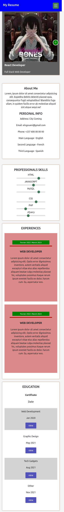

# Resume Portfolio One

Sideland : **## Resume Portolio Application**

> ### Overview :

- Your experience, your aptitude all about the skills that base your talent or what you might be able to do, unified in a steady one file that represents the trend mark used to land job.
- Be able to market yourself is one of he most usefull skill that you need to learn.

## Interest

You might be interested on how:

- to implement linked page with `react-router-dom` on _react_

- or use `bootstrap` inside a _react project_

### Links

- Solution URL: [https://github.com/BeinRain06/resume-portfolio-one.git](https://github.com/BeinRain06/resume-portfolio-one.git)
- Live Site URL: [https://beinrain06.github.io/resume-portfolio-one/](https://beinrain06.github.io/resume-portfolio-one/)

## Description : \* challenge issue

**usecontext Hook**

> I review `usecontext hook`.It was once again challenging like i didn't get well the concept first when i learned and implemented it.
>
> **analyzing**

1.  Here is What I figured out. **Usecontext** solve the problem to store some **data** thats more than **one component** are in need to use. These data can be **fetched API data** or some **state data** that changes is allowed using some events like _onClick_, _onMouseOver_, _onInput_, and many others. **state data changes** is made barely in react using `useState Hook` or `useReducer` .
2.  three essentials spices needs to used in a such a way to achieve good implementation of _useContext Hook_ :

    - a function (e.g_name : AppContext) that **creates** our dealing context using `createContext` from **React** Library

      - e.g
      - `export const AppContext = createContext();`

    - a function (e.g\*name : AppContextProvider) that **handles** \*\*\_state data changes**\* and **specifies** returned **values\*\* we want to made available for the all entire bunch of components we have.

- e.g:

  > `export const AppContextProvider(props) => { const [toggle, setToggle] = useState(false); const [isHovered, setHover] = useState(false);
const isToggled = () => { setToggle(!toggle); console.log(toggle);}; const setHoverFunction = () => {setHover(!isHovered); };const contextValue = { isToggled, setHoverFunction, toggle, isHovered }; return (
<AppContext.Provider value={contextValue}>
{props.children}
</AppContext.Provider>
);
};`

- variables we need called in a **destructuring syntax** in specific components in demands

1. Brief think of :
   - `createContext`and `useState`in the same file (e.g: AppContext.js) and
   - `destructuring syntax variables` and `useContext` in any of the components on demands of these public data.
   -

## CSS Structures:

> - <App/> main component connect to node handle all the javascript need to display all our **related webpages** ,

> four main components :
> -Profile.jsx, Skills.jsx, Experience.jsx, Education.jsx, submit.ejs

**Picture**

---

---

# What I learned

### Use Bootstrap Classes in React

All we need to do is to install bootstrap and import **minified version** of css and js in the **indexjs** file of our project.
After that we can use and learn about classes of bootstrap in the source website : [https://getbootstrap.com](https://getbootstrap.com)
Like this:

- command(inside our directory project) : npm install bootstrap
- add :
  - import "bootstrap/dist/css/bootstrap.min.css";
  - import "bootstrap/dist/js/bootstrap.bundle.min";
- Use Classes you need searching over the bunch of classes given in the official website _getbootstrap.com_

### utilities Materials:

    -bootstrap and bootstrap icons

### Mobile Responsiveness

    - Mobile reponsiveness for mobile max-width: 320px ,max-width: 626px,

**Picture**

---

---

## Callback History:

- **Portfolio** was first used for **investment**. **Harry Markowitz**(born in 1927) is a `Nobel Prize-winning` American economist best known for developing `Modern Portfolio`. **Markowitz** introduced **_Modern Portfolio_** to academic circles in his articles, `"Portfolio Selection"` in the journal of finances. His original theory was fundamentally a way to change how people and institutions **invest**.
- Nowadays `Portfolio` are use in many various cases and especially are well know to be a document that enhances yours skills to seek for a job in a specific area or industry.

## Useful Resources :

- w3Schools: [https://w3schools.com/bootstrap/bootstrap_grid_system_asp](https://w3schools.com/bootstrap/bootstrap_grid_system_asp) : helps me learn quickly how to implement **css grid** using **bootstrap**

- getBootstrap: [https://getbootstrap.com](https://getbootstrap.com) : resources website of bootstrap , helps us to go through the differents uses of bootstrap. And land us to implement `bootstrap grid`, `bootstrap icons`, and `bootstrap classes`

## Acknowledge:

This project always remember the Team :

-Sufa Digital: udemy with his explanations about the 6 layers of security when registering or login to an app

_Our Work always remember this team_

## Author

- Frontend Mentor - [https://www.frontendmentor.io/profile/BeinRain06](https://www.frontendmentor.io/profile/BeinRain06)
- Twitter - [https://twitter.com/nest_Ngoueni](https://twitter.com/nest_Ngoueni)
